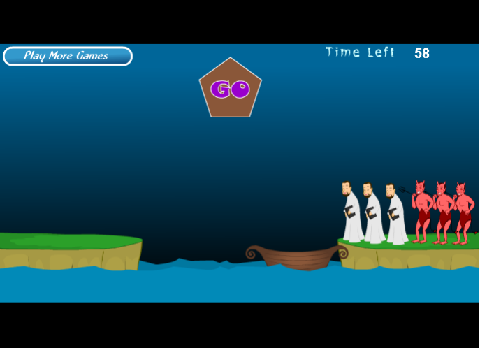

# ***根据后面的素材，识别类和对象:*** 
## 阅读[牧师与恶魔过河](http://www.7k7k.com/swf/10718.htm)的游戏介绍并玩游戏。然后回答问题:    
  

## 1、游戏涉及哪些类。请列表说明：  

|class|
|:-:|
|精灵|
|背景|
|字幕|

## 2、游戏中有哪些对象，各几个。例如，船（一个）：  
$$  
精灵   
\begin{cases}  
\text{牧师（三个）}\\  
\text{魔鬼（三个）}\\  
\text{船（一个）}\\  
\text{河流（一个）}  
\end{cases}  
$$  

$$  
背景  
\begin{cases}  
\text{河岸（两个）}\\  
\text{蓝色背景（一个）}\\  
\text{"GO"图标（一个）}\\  
\text{"Time Left"图标（一个）}\\    
\end{cases}  
$$  

$$  
字幕  
\begin{cases}  
\text{倒计时字幕（一个）}\\  
\end{cases}  
$$  

## 3、类和对象的区别是什么？举一个例子说明：  
&emsp;&emsp; _**类** 是对一些具有相同属性和行为的事物的总称，而 **对象** 就是类中的某一事物。两者是 **从属关系** 。对于计算机语言中， **类就是抽象的数据类型，而对象就是该类下声明的某一变量。**_   
- **游戏中的例子：**  
精灵是类，它是那些具有运动能力的事物的总称，而对象就是精灵这个类中的某一事物，如牧师是一个对象，魔鬼也是一个对象。  
- **计算机语言中的例子：**  
列表是类，即是一种抽象的数据类型，可以对它进行数据存储和操作，而对象就是该列表的类下声明的某一个变量，如做一个班级列表，或者成绩列表。_  

## 4、游戏中的魔鬼，有哪些属性和方法？  
$$
属性    
\begin{cases}  
\text{名字}\\  
\text{大小}\\  
\text{位置}  
\end{cases}
$$

$$
方法  
\begin{cases}  
方法一：&\text{运动}\\  
方法二：&\text{向牧师发动攻击}  
\end{cases}  
$$  

## 5、假设魔鬼被鼠标点中，会执行onclick事件，请用文字 （伪代码）描述这个事件中魔鬼与其他对象沟通的过程。  
```  
onclick(monster){
    ask if something is on the boat  
    change the direction of motion  
} 
```  

## 6、类或对象会是动词吗？  
&emsp;&emsp;会是动词。如一个能够对多个对象进行操作的类，而在这个类下声明的对象也是动词。


 
