# 引言：
  还记得高中时接触到关于命令行运行c程序的知识，当时还真是如看天书一般，啥都看不懂，但又极渴望了解这些知识，想想，不用打开编译器，仅仅打开“运行”-> cmd-> cd到源代码所在的目录 ->再键入一些别人看不懂的命令 ，最终就编译并执行了该程序，这是多么cool的一件事啊，就像电影中那些黑客一样————面对着黑屏，其中的代码疯狂滚动，手在键盘上不断飞舞，没有比这更帅的了。然而，当时的我还不懂去刷刷其他大佬的博客，于是高中的我，无缘于这种“装b”方式。但，如今，我终于大概了解了这些知识，为了报答帮助过我的博客，我也要像他们一样，分享自己的经历。

# 一、编译C语言程序
## （1）设置环境变量:
### 1）寻找文件：
  我们知道，一般的C/C++程序开发经历三个过程：源代码的编辑——编译生成.obj文件——链接生成.exe文件。那么在这个过程中起到关键作用的就是编译器了，也就是我们要找到c的编译器。我暂时用的是dev-c++，所以我主要是以它为例子。但别担心，vs也是差不多的。首先是进入到devc的文件夹中找到bin、lib、include。  
   如图一：  
 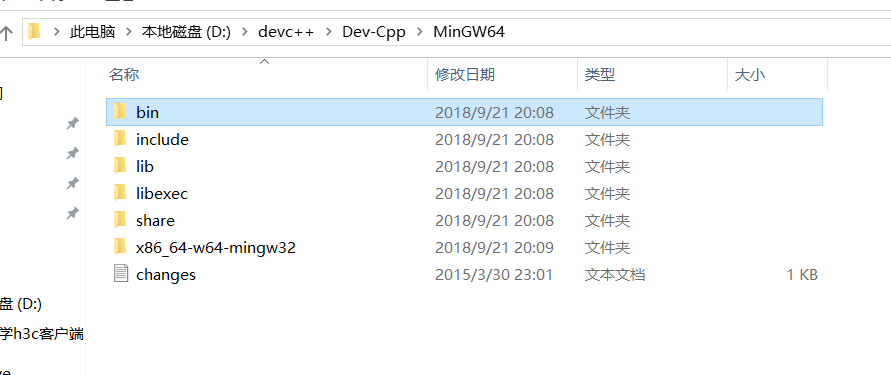  
   bin文件中有gcc.exe编译器，这是必须的，否则在命令行中键入gcc命令，电脑是无法识别该命令的。（有些开发环境的bin中是cl.exe编译器，但都一样，只需要将bin文件的地址设置到环境变量中即可）  
   lib文件中有系统库文件（百度说是起链接程序和函数的作用，其中存放的是函数调用的信息）    
   include文件是系统头文件。    
### 2）添加路径到环境变量中：
  首先是进入环境变量，我的电脑+右键+属性->高级系统设置->环境变量->系统变量->path+编辑，最终就把三个文件的路径添加入其中。  
  
  
  
  在这里又涉及到一个知识，即用户变量和系统变量的问题。  
  在进入到环境变量时，我们会看到用户变量的框框和系统变量的框框：  
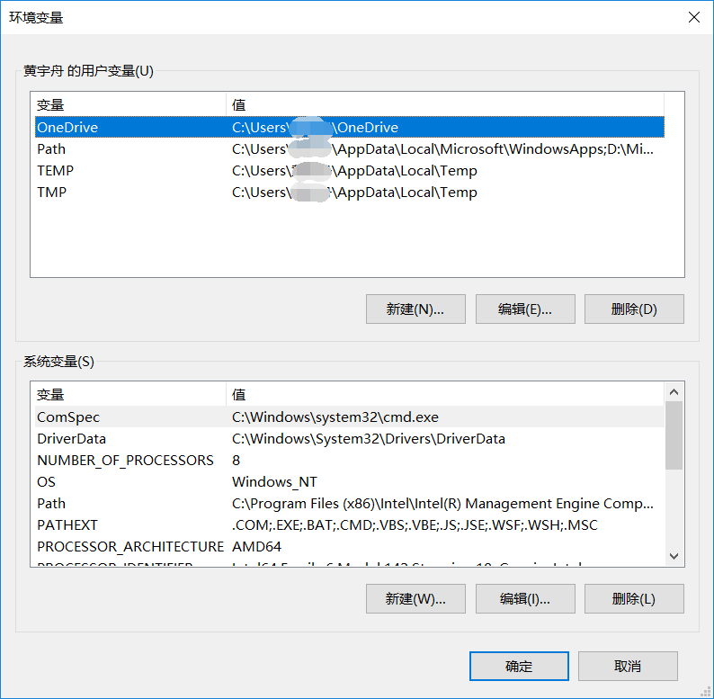  
> 他们下面都有path，这时候就涉及到他们的区别了：   
>>  环境变量分为系统环境变量和用户环境变量。  
 系统环境变量对所有用户起作用而用户环境变量只对当前用户起作 用。例如你要用java，那么你把java的bin目录加入到path变量下 面，那么它就是系统环境变量，所有用户登陆，在命令行输入java都会有java的帮助信息出来。而如果你在某个用户的变量下面新建一个变量，那么它就只对这个用户有用，当你以其他用户登陆时这个变量就和不存在一样。  
### 3）验证是否成功配置：
  运行->cmd进入命令行，输入gcc -v，如果出现类似下图的结果，则成功。  
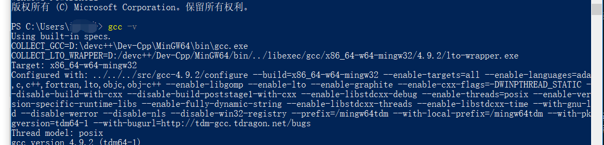  
## （2）编译程序
  首先写一个简单的c程序：  
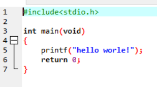  
  然后进入到命令行中，并cd到源文件所在的目录：  
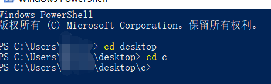  
  再然后键入命令：gcc 文件名.c:  
  
  这时候会生成a.exe的可执行文件（大家应该知道.exe是指可执行文件，window默认生成a.exe，即a是编译hello.c程序后生成的hello.c的可执行文件的名称）  
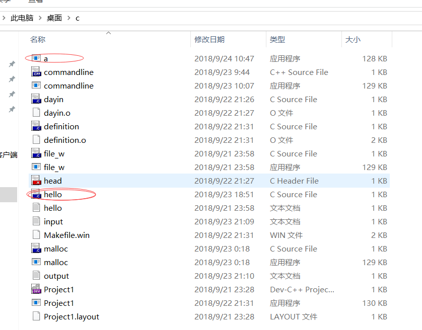  
  看画圈圈的，其他东西不用管，那些是我的其他程序，你们会发现，其中并没有hello.exe，但有个a.exe，这就证明了上面的说法。  
  如果想要生成hello.exe，那上面键入命令应改为：gcc -o hello hello.c:  
  
   这是就生成了hello.exe：  
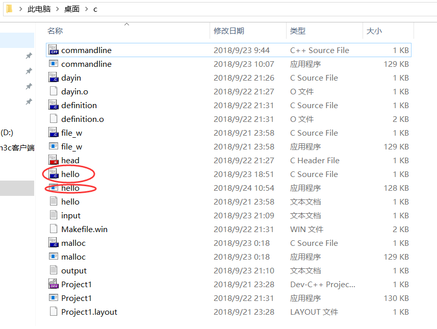  
   这里稍微解释一下，-o是gcc的参数之一，表示重命名编译出来的可执行文件，所以讲到这，大家大概对命令行有了更深刻的了解了吧。至于gcc的其他命令，大家可以上网查一查，我暂时还没去了解别的，所以就不在这做拓展了。  

# 二：运行程序 
   其实到这，已经准备到尾声了，上面编译完程序后，就到运行了，
   应该键入的命令为：.\文件名.exe：    
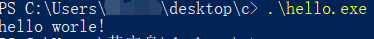    
   这里再解释一番，'.'代表当前文件夹，'.\'代表在当前文件夹下，很多博客都说直接键入 文件名.exe ，但我这么键入会出现错误：  
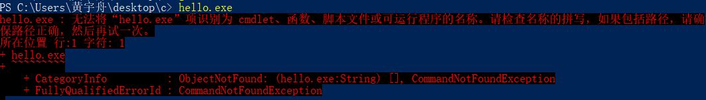  
   然后有的说在linux环境下才键入'.\文件名.exe'，所以这点我就不怎么知道了，可能是win10的特殊性吧。  

   最终，便这么通过命令行编译并运行了c程序了，是不是感觉很cool，我也这么觉得，但前提是要熟练，否则还不如进入软件编译。。。

   在这里再拓展一点，关于那些要使用命令行参数的程序：    
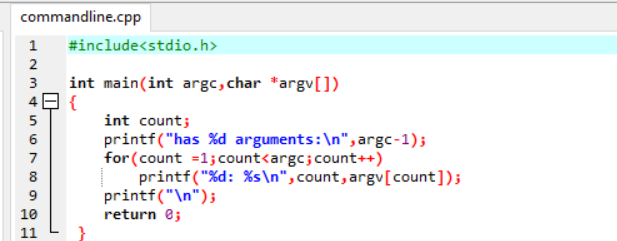  
   即在运行时在 文件名.exe 后面键入参数即可：  
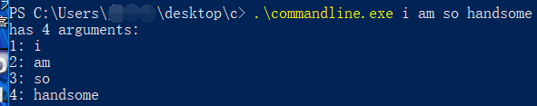

就这样，没有啦。。。  
加油!!!