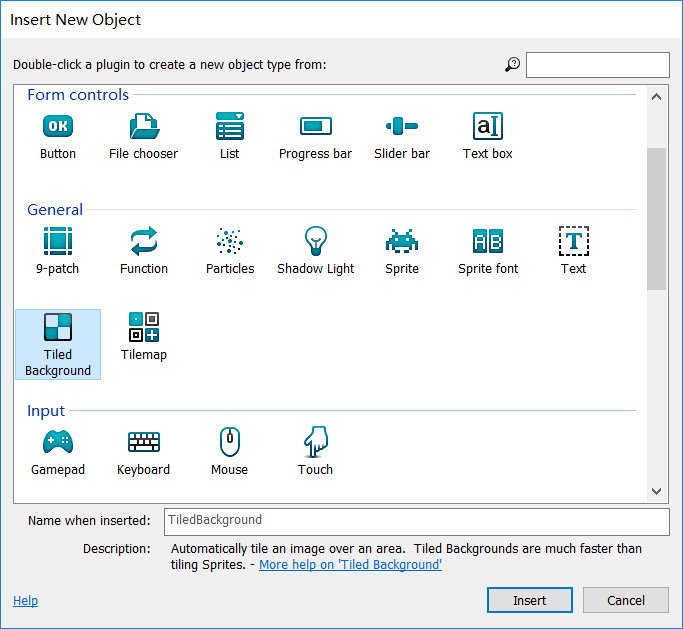
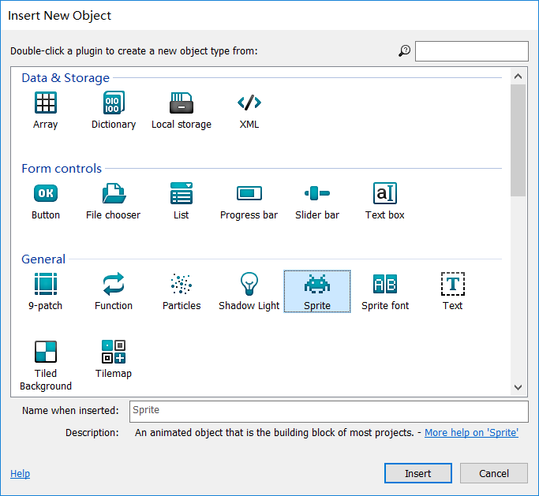
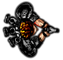
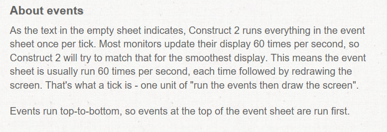
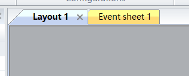

# &emsp;&emsp;&emsp;&emsp;&emsp; ***construct 2新手游戏制作***  
# ***一、安装construct 2***
---  
[construct 2](https://www.scirra.com/construct2)
软件样子：  
  

# ***二、游戏制作*** 
--- 
## **1、建立工程**  

  

## **2、添加对象**  
>**(1)背景层次（layer0）设置**  
   &emsp;&emsp;_先是添加背景图片，步骤：右键点击背后空白处，选择添加object :_  
     
   &emsp;&emsp;_进入下一个界面后，选择“tiled background” :_ 
     
   &emsp;&emsp;_然后鼠标会变成“+”，在背后的空白处点击一下，然后在本地中找到想添加的图片 :_
     
   &emsp;&emsp;_×掉后，这时会发现背后白板与自己加入的图片不完全重合，所以，要对尺度进行修改。左键点击加入的图片，复制它的尺度：_  
     
   &emsp;&emsp;_再点击后面的白板或者灰板，将尺度黏贴到“Layout Size”上；_  
     
   &emsp;&emsp;_做完后，就发现重合了。_  
**(2)人物层次(layer1)设置**   
    &emsp;&emsp;_首先进入层次的栏目，能看到“layer0”，这个是刚刚我们设置背景的层次，在后来的操作并不需要更改背景，毕竟背景本来也仅是静态的，所以我们可以尝试锁住它：_  
        
    &emsp;&emsp;_然后新建一个layer，重命名为“Main”，作为游戏进行的主要层次，意思就像程序中的那样，是程序运行的主要函数。选中main层次后，就要开始对该层次添加项目了，即人物。_  
    &emsp;&emsp;_添加的步骤跟前面设置背景大致一样，只是选的东西不同：_  
        
    &emsp;&emsp;_至于添加什么人物，我就提供常用图片：_  
          
    &emsp;&emsp;_添加完后，可以在右下角的栏目中对人物重命名，改为你想要的名字：_  
       
    &emsp;&emsp;_然后我们再将子弹和爆炸图片移出layout界面，也即游戏界面，毕竟我们并不希望这两个图片一开始就出现在游戏界面里，而希望他们是在需要的时候出现：_  
      
## ***注意：在添加项目过程中还需要添加两个特别的，即鼠标、键盘。***  
>**(3)人物层次里的行为设定**   
    &emsp;&emsp;_这里对每个项目的行为进行各自设定的操作就像程序中的宏，对每个函数和类型等进行了定义。点击各个对象，添加各自行为（图片左上角是项目名称）：_  
      
      
      
      
        
    &emsp;&emsp;_然后这里可以对各个项目进行些其他操作，如修改小怪速度、添加小怪数量，添加的操作就是在layout中点击该项目，然后按住<kbd> Ctrl </kbd>,鼠标按住并移动，就可以复制了：_  
      
    

## ***3、添加事件***  
    &emsp;&emsp;前面的操作就像程序中的宏定义和包含文件，其目的就是将需要的类型、常量、函数、宏都声明设定好，而添加事件，就像开始编写程序执行任务的代码，以这样的思想进行以下的操作，会很简单就理解操作的作用。  
>**（1）简述事件**  
    &emsp;&emsp;事件就像程序中的执行任务的代码，但它却有所不同，即它本身是个循环体，会从一开始就执行并循环，如图所示：  
      
    &emsp;&emsp;同时，事件的所有语句可以说是条件语句，即有“condition”才“action”。  
    &emsp;&emsp;讲完这两个核心，以下的讲解将快速进行，毕竟懂了思想，操作就可以说都是重复的。  
>**（2）添加事件**  
    &emsp;&emsp;_先详解第一个事件的添加，首先要进入事件添加界面：_  
      
    &emsp;&emsp;_我们的第一个事件是鼠标指向哪里，玩家人物就面向哪里。先点击“add event”，然后添加：_
       
      
      
      
      
      
       
    &emsp;&emsp;_第一个事件中的东西按照字面意思还是可以看懂的，然后在以条件语句的思想看这个事件，就更能理解它的意思。_  
    &emsp;&emsp;_下一个事件就是：当点击一次鼠标左键时，发射一个子弹，子弹要出现在main层次中，即layer1层次（当然要在这个层次出现，因为这是人物项目添加在的层次）_  
        
    &emsp;&emsp;_然后我们还可以添加别的事件：_  
      
        
    &emsp;&emsp;_这时我们还可以给小怪添加事件，一个是刚进入界面是小怪是随机方向运动，另一个是当小怪运动到layout边界时会转向并指向player运动：_  
      
        
    &emsp;&emsp;_这时候我们还可以添加一个事件，即当子弹打到小怪时，子弹消失，产生爆炸，小怪消失：_  
       
>**（3）实例变量和全局变量**  
    &emsp;&emsp;在C语言中，我们有自动变量和静态变量，而实例和全局和他们是相对应的。在这里，我就讲讲他们在游戏中的应用。  
    ***实例变量：***   
    &emsp;&emsp;_我们可以尝试增加小怪的命，即要射击三次才会毁灭，这时我们就需要一个变量记录小怪被射击的次数，或者生命的条数，但我们当然不希望当毁灭一个小怪时，其他也跟着毁灭，所以我们需要一个实例变量，即它的作用域只局限于每一个项目，即每一个小怪，所以就可以尝试声明一个实例变量“health”，初始值为3，每被射击时减一，当值“<=0”时消失，这里就涉及到修改前面的事件：_  
      
      
      
        
    ***全局变量：***  
    &emsp;&emsp;_当然，游戏不能只玩而没任何成果记录嘛，所以我们需要一个变量记录我们杀死小怪的数量，但我们是不希望它在我们消灭完一个小怪后就被重置为0，而希望它能在整盘游戏中保持正常记录，所以这时我们就需要一个作用域为全局的变量，不受任意一个项目的局限。在event空白处点击右键：_  
      
      
        
    &emsp;&emsp;_这里就和刚刚health联系在一起，即当health<=0时，即杀死一个小怪，分数加一。_  
>**（4）添加HUD**  
    &emsp;&emsp;_HUD简单说就是游戏上方的字幕，用来显示玩家生命值、分数等信息。_  
        
    &emsp;&emsp;_可以想下，游戏字幕是与人物项目无接触关系的，所以我们可以再将它放在一个新的层次（layer2）HUD，选中它，到会layout中添加项目Text，可以在左下角改变Text的颜色，大小，粗细等：_  
      
      
      
      
        
    &emsp;&emsp;_但这仅是添加了个Text字样，并未达成我们记录分数的目的，所以我们就需要让其表示分数，并时时更新分数，于是我们会发现，要这么做，只有去添加相关事件，到回事件界面，添加一个事件，目的就是显示“score：数值”，其中使用了“&”，我想学过编程的会知道这是什么意思。_  
      
    &emsp;&emsp;_然而，当我们运行时，会发现字幕并不无法跟着人物走，这是我们就需要调节“视差”，前面讲HUD的英文中有些解释。具体步骤是，点击HUD层次，将左边的栏目中的“parallax”改为0，0：_  
      
>**（5）完成全部事件**
    &emsp;&emsp;_最后我们还需要添加两个重要的事件，一个是让小怪定时产生，另一个是当小怪撞到玩家时，玩家消失：_  
      
        

## ***&emsp;&emsp;至此，游戏的基本构架与成分就完成了，至于别的，如玩家生命值、重新开始等事件，我后续会补充。***

    

    

    

     

