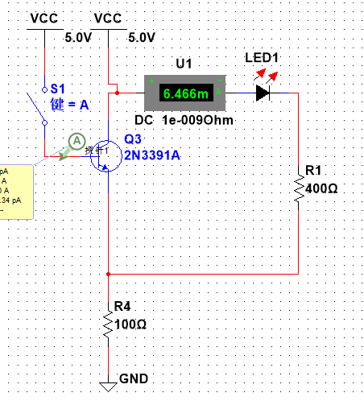
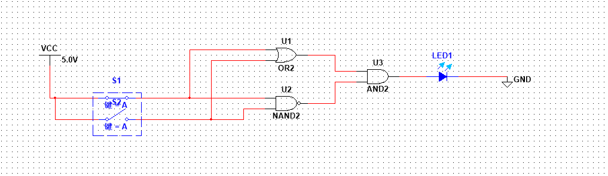

# ***任务 1：建立一个简单电路***  
## （1）建立非门功能(O = A’)验证电路：  
 

## （2）真值表： 

|INPUT|OUTPUT|
|:-:|:-:|
|1|0|
|0|1|

##  (3)XOR电路：  

# ***任务 2：验证电路等价***  
## （1）分别建立电路 A（B+C）和 AB+AC 在一个界面上。用 A，B，C 用三个开关控制输入，用两个 LED 表示输出。  
  

## （2）真值表:

|A|B|C|B+C|A(B+C)|AB|AC|AB+AB|
|:-:|:-:|:-:|:-:|:-:|:-:|:-:|:-:|
|0|0|0|0|0|0|0|0|
|1|0|0|0|0|0|0|0|
|0|1|0|1|0|0|0|0|
|1|1|0|1|1|1|0|1|
|0|0|1|1|0|0|0|0|
|1|0|1|1|1|0|1|1|
|0|1|1|1|0|0|0|0|
|1|1|1|1|1|1|1|1|

# ***任务 3：理解存储电路***  
## （1）按课件 S-R latch 搭建电路：  
**存储‘1’：（led3为存储状态）**    

 

**存储‘0’：**  

## （2）真值表： 

|~set|~reset|Q(x)|~Q(y)|
|:-:|:-:|:-:|:-:|
|1|1|0|1|
|0|1|1|0|
|1|1|1|0|
|1|0|0|1|
|1|1|0|1|

# ***任务 4：设计全加电路***  
## （1） 画出一位的全加电路。  

## （2）二位全加器：  
  

## (3)八位全加器:

