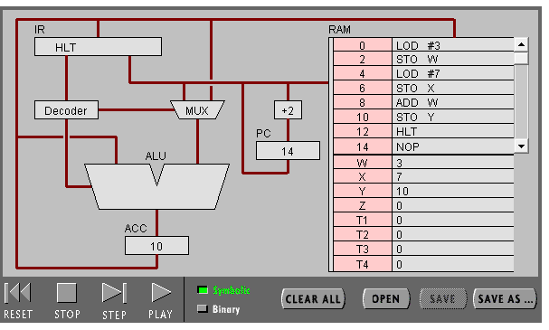

任务 1：简单程序  
1、打开网页  ，然后输入 Program 1：Add 2 number. 

  
2、点step after step。观察并回答下面问题：  

（1） PC，IR 寄存器的作用： 
PC:储存下一条指令的地址。  
IR：储存将要运行的指令

（2）ACC 寄存器的全称与作用：  
全称：accumulator(累加器)；  
作用：存储数据和计算的结果。  

（3） 用“LOD #3”指令的执行过程，解释Fetch-Execute周期。  
首先从内存中读取（Fetch）指令，通过解析器解析操作码，然后将操作数3读入到ALU进行“赋值运算”（Execute）。  

（4） 用“ADD W” 指令的执行过程，解释Fetch-Execute周期。  
首先从内存中读取（Fetch）指令，通过解析器解析操作码，即要进行“加法运算”，将ACC中的数据读出到ALU中，然后将通过地址"W"从内存中将其中数值读入到ALU中，最终进行“加法运算”（Execute）。  

（5） “LOD #3” 与 “ADD W” 指令的执行在Fetch-Execute周期级别，有什么不同。  
“LOD #3”：可直接将数值（即操作数）“赋值”进ALU中，然后存入ACC中；
“ADD W”：在将数值读入到ALU前，需要先将ACC中的数据读入到ALU中，然后才能读入W中的数值并进行“加法运算”。   

3、点击“Binary”,观察回答下面问题：  
（1）写出指令 “LOD #7” 的二进制形式，按指令结构，解释每部分的含义。

  

图中黑色部分即为该指令。  
前三位代表“寄存器模式”，而“000”即代表使用“ACC”寄存器；  
第四位代表“寻址模式”，“1”即指操作数是数值，“0”即指操作数是该地址的内容；  
后四位代表“操作码”，即进行何种运算的指令。  

（2）解释 RAM 的地址：  

