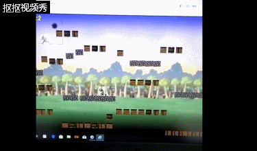
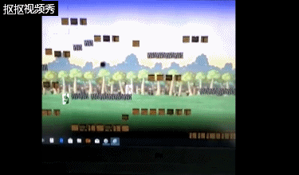

# ***概念文档***  
## **楔子（seting）：** 
&emsp;&emsp;很久很久以前，世界分为人类和恶魔两大阵营，但随着大陆暗夜季的到来，恶魔的实力逐渐增强，性情也变得更加狂暴，于是，恶魔趁着这天时地利，突然对人类世界发动战争，以偷袭之势侵占了人类边疆数地，并对边疆地区百姓进行了屠杀和掠夺。就在这风起云涌的时候，强大而神秘的民间高手纷纷出现，其中就有个自称“飞人”的高手，他不惧强大无情冷酷的恶魔，毅然只身冲往边疆重地，在那展开了一场惊心动魄的人魔对战。  

## **玩法：**  
&emsp;&emsp;玩家在游戏坚持两分钟即任务完成。玩家生命值降为零，即任务失败。玩家可以通过键盘四个的方向键来完成 **“正跳跃”“斜跳跃”“起步”“跑步”“蹲下”** 等动作并伴有不同的人物效果。同时单击鼠标左键还能够发射绚丽的光波，若攻击到恶魔，能够扣除恶魔的一个体力值。除此以外，玩家踩在恶魔头上也能够扣除恶魔的一个体力值。

## **人设与道具：**  
1、**player：** 无道具。刚开始会有三个体力值。可以通过释放光波或者脚踩来攻击恶魔。  
2、**moster：** 无道具。刚开始会有五个体力值，同时每五秒产生一个恶魔。当恶魔从侧边过上面触碰到玩家时，玩家会扣除一个体力值。同时恶魔每五秒也会朝着玩家的方向发射邪光波动，触碰即扣除一个体力值。  
  
# CRC卡片：  
1、

|object name|飞人 |
|:-|-:|
|**attrbutes**|Main layer|
|**collaborator**|sprites|
|**event&action**|发射&四方向运动|

2、

|object name|monster |
|:-|-:|
|**attrbutes**|Main layer|
|**collaborator**|sprites|
|**event&action**|发射&三方向(跳、左右)|  

3、

|object name|光波动 |
|:-|-:|
|**attrbutes**|Main layer|
|**collaborator**|sprites|
|**event&action**|朝发射时的方向运动&撞击|

4、

|object name|邪光波动 |
|:-|-:|
|**attrbutes**|Main layer|
|**collaborator**|sprites|
|**event&action**|朝发射方向运动&撞击|

5、

|object name|字幕 |
|:-|-:|
|**attrbutes**|HDU layer|
|**collaborator**|text|
|**event&action**|动态显示&静态显示|

6、

|object name|墙壁|
|:-|-:|
|**attrbutes**|Main layer|
|**collaborator**|sprites|
|**event&action**|完全坚硬OR部分坚硬(可下往上)|

# ***游戏演示：***  

  

**不知道电脑出了什么问题，游戏的文件突然不见了，这个视频是在游戏做完后用手机拍的，没办法，只能这样截下来了**