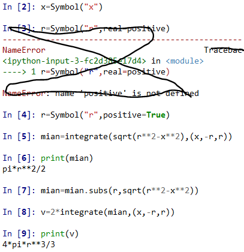

# ***使用python求解***  
## **1、选择2个高等数学上的作业，如泰勒分解、公式化简、解方程等。**  
### **基本线性方程：**  
  

**极限求解：**

证明：$ lim_{n\to\infty}n(x^{\frac{1}{n}}-1)=lnx $ 

  

**求不定积分：**

$\int\frac{1}{x^2+a^2}dx$  

  

**求定积分：**  
$V_{ball}=\frac{4}{3}\piR^3$  
  

## **2、选择2个线性代数上的作业，如求dot、逆矩阵等，最好会解方程。**  
**矩阵乘法：**

  

**逆矩阵：**  
 
