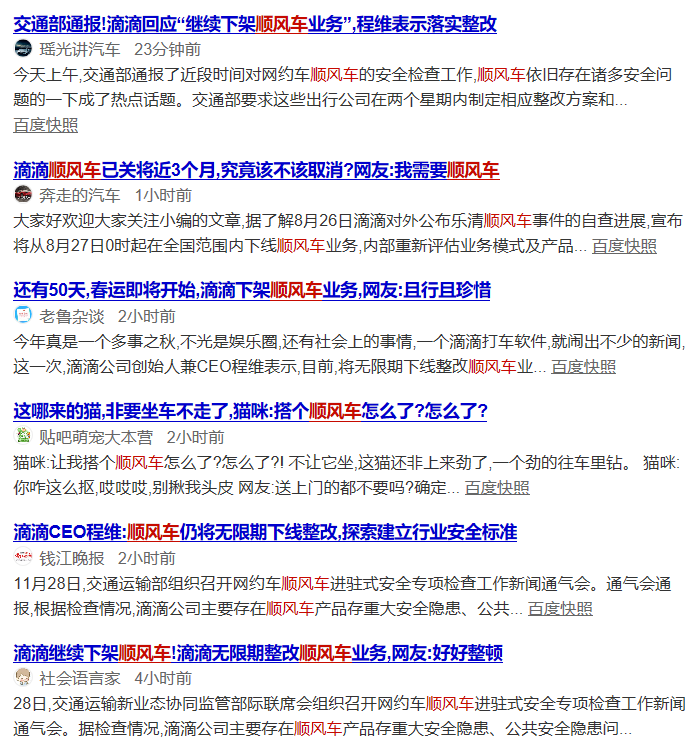
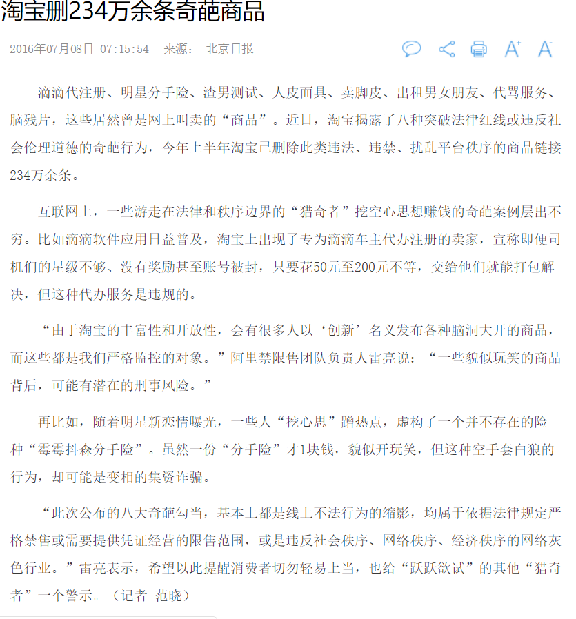

# ***模仿***  
&emsp;&emsp;***在如今权力意识逐渐提高的时代，许多人都会将IT界的“模仿”和“抄袭”看成等同的事物，认为以他人技术为模板进行的制造行为是恶劣的、侵权的、应当受到舆论的谴责的，但在不同的社会环境中，模仿却会却起着无法比拟的作用。***  
## 比如qq和icq：  
&emsp;&emsp;腾讯QQ，互联网的老玩家都知道，其原名是“OICQ”。腾讯QQ其实是一款完全复制了ICQ的产品。ICQ即I SEEK YOU的缩写，互联网一知名网络传呼机产品。QQ后来被ICQ告上法庭，被迫更名QQ。后来逐步发展壮大，到今天拥有了8亿注册用户，2亿活跃用户。  
&emsp;&emsp;在这里，QQ之所以能够快速占有中国市场，成为中国的主要通讯软件，很大一原因就是ICQ不能满足中文用户的使用习惯。当时ICQ的全部信息存储于用户端，一旦用户换电脑登录，以往添加的好友就此消失，而QQ的用户资料存储于云服务器，在任何终端都可以登录聊天。当时由于在国外，用于基本上上网都在个人电脑上，所以也就不担心丢失。而当时的中国，互联网并没有普及，许多人上网都是在网吧，大家没有自己的电脑，根本不可能保存信息，最需要的就是让这些信息实现储存在服务器了。而腾讯QQ就凭借了这点迅速发展，从抄袭模仿到最后赶超，这是从技术层面到服务层面的扩张和创新，模仿的背后是更深层次的企业思索，所以，这算的上是一次极为成功的模仿，其取代的结果也是IT界可预料的。

 

# ***安全***  
&emsp;&emsp;**在如今互联网迅速发展的时代，用户信息的安全性逐渐被人们所重视，在网络这个庞大的虚拟世界中，身份等信息的稍有泄漏，极有可能给用户带来无法想象的安全危机，而近期在中国掀起的极大浪潮，就是“顺风车”。**
    
&emsp;&emsp;从刚开始的滴滴到后来延申出来的顺风车，本来是本着给客户带来无限方便的初衷，但在利益的驱动下，顺风车走上了歧路。从原本对客户信息的大部分保密到后来逐渐到客户信息的完全透明，更是到后面对客户信息含有部分“色情”的显露，都给该软件以及该服务模式带来极大的安全性问题，而最终的结果也是对“安全第一”的最大诠释。

  
# ***除了安全性，还有的就是IT界的造假信息宣传以及完全侵犯法律的“哗众取宠”的行为。***  
## **典型例子就是淘宝网：** 
&emsp;&emsp;滴滴代注册、明星分手险、渣男测试、人皮面具、卖脚皮、出租男女朋友、脑残片……当你在淘宝上看到这些时，是啥心态？哈哈一笑，还是出于猎奇心态也买一个玩玩？其实，这些都是突破法律红线或违反社会伦理道德的奇葩行为。以违反法律和道德底线来取得利益，这可以说是对IT界极为巨大的侮辱，更可以说是对人们认识底线的挑战。最终，在巨大的舆论压力下，淘宝网删掉了违法、违禁、扰乱平台秩序的商品链接234万余条，以此来换回自身的企业清白和良好形象。  

  

