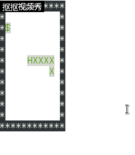
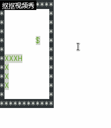

# ***程序设计与分析：***  
## 主函数（main）:
```c
int main()
{
        //设置终端进入非缓冲状态
    int tty_set_flag;
    tty_set_flag = tty_set();
    printf("\033[2J");      //清屏
    printf("\033[1;1H");    //光标定位在第一行第一列
    
    output();               //输出初始地图
    printf("\033[?25l");    //隐藏光标
    
    while(1) {
             
        usleep(200000);     //蛇的移动速度，0.2s移动一次

        if(!flagmoney)     //正确产生食物
        {
            put_money();
            flagmoney=1;
        }

        ch=wheretogo();     //判断蛇将要向哪边移动
        switch(ch)
        {
            case 'a':snakemove(0,-1); //left
                 break;
            case 'd':snakemove(0,1); //rigth
                break;
            case 'w':snakemove(-1,0); //up
                break;
            case 's':snakemove(1,0); //down
                break;
            default:break;
        }
        if(checkmany())       //是否撞上自身或墙壁
            break;

        printf("\033[2J");     //再次清屏，为下一次输出清空原来内容
        printf("\033[1;1H");    //定位光标
        output();         //更新界面

        if( kbhit() )           //判断玩家是否输入‘q’来结束游戏
        {
            const int key = getchar();
            printf("%c pressed\n", key);
            if(key == 'q')
                    break;
        } 
        else
             ;
    }

    gameover();     //结束游戏

    //恢复终端设置
    if(tty_set_flag == 0) 
        tty_reset();
    printf("\033[?25h");
        return 0;
}
```

## 行走函数（wheretogo）：
```c
char wheretogo(void)
{
    char direction[4]={'a','s','d','w'};   //方向数组设置
    int distance[4]={0,0,0,0};             //初始化蛇头四个位置到食物的距离

    //初始化蛇头周边的四个位置的数值
    //x坐标
    int positionx[4]={snakex[snakelength-1]-1,snakex[snakelength-1],snakex[snakelength-1]+1,snakex[snakelength-1]};
    //y坐标
    int positiony[4]={snakey[snakelength-1],snakey[snakelength-1]+1,snakey[snakelength-1],snakey[snakelength-1]-1};

    //以下为最核心的部分，是蛇能够实现智能的关键。
    //下面代码主要功能：判断蛇周边四个位置中距离食物最近的一个位置；
    //                 判断蛇的下一步是否会导致蛇进入死胡同（但这个功能很局限）；
    int i;
    for(i=0;i<4;i++)
    {
        //得到周边位置到食物的距离，同时判断都到该位置是否会导致蛇进入死胡同
        if(positionx[i]<1||positionx[i]>10||positiony[i]<1||positiony[i]>10||checkone(positionx[i],positiony[i])||istodie(positionx[i],positiony[i]))
            distance[i]=9999;
        else
            distance[i]=positive(positionx[i]-money[0])+positive(positiony[i]-money[1]);
    }

    //判断最优下一步
    int min=distance[0],index=0;
    for(i=1;i<4;i++)
    {
        if(min>distance[i])
        {
            min=distance[i];
            index=i;
        }
    }
    return direction[index];    //返回最优下一步方向
}

//以下函数的主要功能：判断某一位置是否是死胡同
//原理：看看这个位置的周边四个位置是否有两个位置是可以行走的，即不会撞墙或撞自己，若有，则不是死胡同，否则是。
int istodie(int x,int y)
{
    int positionx[4]={x-1,x,x+1,x};
    int positiony[4]={y,y+1,y,y-1};
    int i,state=0;
    for(i=0;i<4;i++)
    {
        //判断是否撞上自己或墙
        if(!(positionx[i]<1||positionx[i]>10||positiony[i]<1||positiony[i]>10||checkone(positionx[i],positiony[i])))
            state++;    //记录
        if(state==2)
            return 0;
    }
    return 1;
}
```

# 实验演示：
 
&emsp;  

# 学习新得及心得：
## 学习新得：
- 在虚拟机上装Linux系统，并见识了linux系统的命令行操作；
- 学到了如何在Linux系统的命令行界面通过vim进行文本编辑以及通过使用gcc相关命令在命令行中编译执行代码；
- 学到了如何让自己的程序充满动态感，实现游戏应有的最基本的功能；
- 除此之外，还学到了一些零碎的基本电脑知识，给自己这个电脑小白补充了点营养。

## 学习心得：  
&emsp;&emsp;在学习新知识的，不能过于急躁，也不能过于贪心（即向把最细节的任何东西都学会）。前者会导致什么都没看懂，后者不仅会导致既没看懂，又 ***waste a great deal of time , which will drag you into endless despair .*** 所以，在学习新知识时，要以完成特定目标为主要目的，行动上为其服务，时间要有条理，绝不能因一时贪心而停滞在某个新知识中，这样一定会 ***弄巧成拙。***